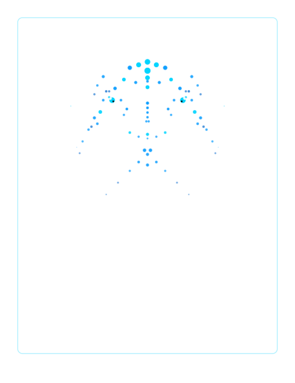

# 

### VIGNESH GANDHI
**Engineer • Builder • Problem Solver**

Crafting elegant solutions to complex problems. Full-stack developer with depth in AI/ML, deterministic systems, and user-centered design.

  <a href="https://github.com/vignesh06-OG" target="_blank" style="text-decoration: none; margin: 0 12px;">
    <code style="background: rgba(0, 212, 255, 0.1); padding: 4px 8px; border-radius: 3px; color: #00d4ff;">GitHub</code>
  </a>
  <a href="mailto:gandhivighnesh415@gmail.com" target="_blank" style="text-decoration: none; margin: 0 12px;">
    <code style="background: rgba(0, 212, 255, 0.1); padding: 4px 8px; border-radius: 3px; color: #00d4ff;">Email</code>
  </a>
  <a href="https://linkedin.com/in/vignesh06-og" target="_blank" style="text-decoration: none; margin: 0 12px;">
    <code style="background: rgba(0, 212, 255, 0.1); padding: 4px 8px; border-radius: 3px; color: #00d4ff;">LinkedIn</code>
  </a>

---

## SELECTED WORK

### **PRISM — Light-Refraction Logic Puzzle Platform**

A deterministic optical logic puzzle engine with 13 hand-built campaign levels, three real-world physics field missions, and an ML-powered difficulty estimation system.

**Technical Depth:**
- Deterministic beam engine with complete light simulation (reflection, dispersion, color mixing, total internal reflection)
- Exhaustive BFS solver validating every puzzle with proven optimal solutions
- PhotonMind: distillation ML model (ridge regression) for difficulty prediction with explainability
- Living rulebook: unlocks 7 optical laws only when player discovers them
- Field missions: real geometric calculations (Snell's law, minimum deviation)
- Full accessibility: color-blind glyphs, keyboard play, reduced-motion, WCAG-tested
- React 19 · TanStack Start · SVG rendering · Tailwind v4 · localStorage + Postgres backend

**Demo:** [brain-game-blitz.vercel.app](https://brain-game-blitz.vercel.app/)  
**Code:** [github.com/vignesh06-OG/prism](https://github.com/vignesh06-OG/prism)

---

### **Resolve 90 — AI Stadium Incident Command**

A grounded GenAI incident-to-action compiler that turns fragmented signals into auditable, human-approved intervention plans under 90 seconds.

**Technical Depth:**
- Domain-driven architecture: presentation ↔ application ↔ domain (ports/adapters)
- Responsible AI: schema validation, guardrail challenge, counterfactuals, explainability
- Evidence narrative: every recommendation includes evidence, alternatives, confidence, ownership
- Quality gates: strict TypeScript, E2E tests, Lighthouse thresholds, bundle budgets, coverage >95%
- WCAG 2.2 AA accessibility · structured generation to Gemini with fallback replay mode
- React · Vite · TypeScript strict · Zod · Playwright · GitHub Actions CI/CD

**Key Features:**
- Deterministic replay mode for offline reproducible judging
- Decision chain: signals → grounding → generation → guardrails → counterfactuals → approval
- Live demo with realistic stadium disruption scenario

**Code:** [github.com/vignesh06-OG/resolve-90](https://github.com/vignesh06-OG/resolve-90)

---

### **TalentLens AI — Recruiter-Trustable Candidate Discovery**

An AI recruiting engine that ranks talent through semantic matching, trust scoring, and explainable counterfactual reasoning. Zero backend. Zero external dependencies. Browser-only.

**Technical Depth:**
- Deep JD parser: extracts skills, seniority, years, must-have vs nice-to-have, domain
- 100+ node skill ontology with aliases: `k8s → kubernetes`, `GenAI → LLM`, etc.
- Trust Engine: confidence %, evidence coverage %, risk level, discovery potential
- 4-signal ranking: semantic fit + experience + career trajectory + activity signals
- Counterfactual analysis: "Why not #1?" with estimated score gain and potential rank
- ATS vs TalentLens comparison: exposes hidden talent missed by keyword filtering
- Vanilla JS · HTML · CSS · zero dependencies · client-side only · 19 passing tests

**Demo:** [talen-tlens-ai.vercel.app](https://talen-tlens-ai.vercel.app/)  
**Code:** [github.com/vignesh06-OG/TALENTlens-AI](https://github.com/vignesh06-OG/TALENTlens-AI)

---

## TECH STACK

**Languages**  
C++ · C · Python · TypeScript · JavaScript · HTML · CSS

**Frontend**  
React · Next.js · TanStack Start/Router · Tailwind CSS · Motion for React · SVG

**Backend & AI/ML**  
Node.js · Express · Python (scikit-learn, numpy) · Gemini API · Ridge Regression · BFS Algorithms

**Data & Infrastructure**  
PostgreSQL · SQLite · localStorage · Zod (validation) · JOSE (auth)

**Quality & DevOps**  
TypeScript strict · ESLint · Playwright · GitHub Actions · Lighthouse · Bundle analysis · Docker

---

## APPROACH

**Engineering Discipline**
- Deterministic systems over probabilistic approximations
- Domain-driven architecture separating business logic from presentation
- Exhaustive validation where correctness matters (solvers, accessibility)
- Explainability built in, not bolted on

**User Focus**
- Geographic/spatial context when it exists (SurvivaLoop, PRISM)
- Human authority over autonomous decisions (Resolve 90)
- Evidence over scores (TalentLens)
- Accessibility as a first-class concern

**Quality**
- Comprehensive testing (unit, integration, E2E, accessibility)
- Strict TypeScript with maximum compiler safety
- No external service dependencies when possible
- Production-ready error handling and edge cases

---

## INTERESTS

🔭 **Currently Exploring**
- Optical simulation and physics-based puzzles
- Responsible AI governance and decision support
- Deterministic algorithms and mathematical rigor
- Accessible design for complex interfaces

🌱 **Passionate About**
- Clean architecture and maintainable systems
- AI explainability and trust
- Developer tooling and productivity
- Open source and community

---

**Building systems with intention. Code with craft.**

