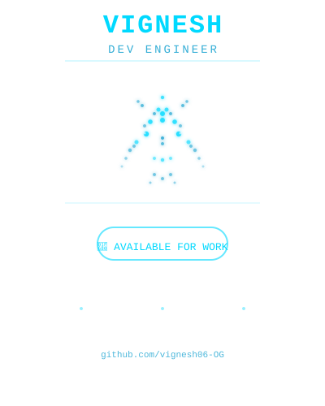

# Vignesh Gandhi

**Full-Stack Engineer | Open Source Contributor | Tech Enthusiast**

  
  
  

---

## 🚀 About Me

I'm a developer passionate about building scalable, elegant solutions that solve real problems. I specialize in full-stack development with a focus on clean code, modern architecture, and user-centered design. When I'm not coding, I'm exploring new technologies, contributing to open-source projects, and sharing knowledge with the dev community.

**Currently:** Exploring cloud-native architecture, microservices patterns, and DevOps practices.

---

## 💻 Tech Stack

### 🔤 Languages

### ⚛️ Frontend

### 🔧 Backend

### 🛠️ Tools & DevOps

---

## 📌 Featured Projects

| Project | Description | Tech |
|---------|-------------|------|
| **Portfolio README** | Professional GitHub profile with particle-art portrait and tech showcase | SVG, Markdown |
| Your Projects Here | Add your best and most interesting projects | — |

*👉 Check out my repositories for more work and experiments*

---

## 📊 GitHub Statistics

---

## 🎯 What I'm Focused On

- 🔭 Building production-ready full-stack applications
- 🌱 Mastering system design and scalable architecture
- 🤝 Collaborating on open-source and innovative projects
- 💡 Continuously learning and experimenting with emerging technologies
- 📚 Sharing knowledge and helping the developer community

---

## 💬 Let's Connect

I'm always open to interesting conversations about technology, potential collaborations, or just geeking out about the latest dev trends.

- **Email:** gandhivighnesh415@gmail.com
- **GitHub:** [@vignesh06-OG](https://github.com/vignesh06-OG)
- **Location:** 🇮🇳 India

---

**Made with ❤️ by Vignesh**

*"Code is poetry, and good architecture is its rhythm."*

