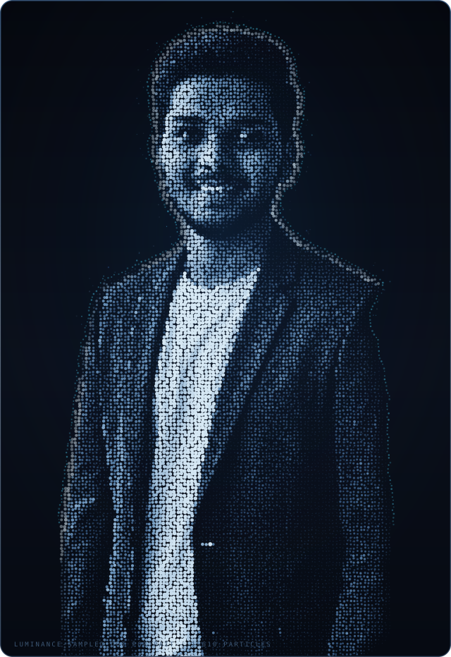

<table>
<tr>
<td width="45%" align="center" valign="middle">

</td>
<td valign="top">

HI THERE 👋

### VIGNESH GANDHI

**Developer · Builder · Problem Solver**

SY E&TC engineering student (KKWIEER · SPPU) building across the stack — from AI products and hackathon builds to embedded systems and open source. I ship things that run, then I explain how they work.

&nbsp;

[<code>github/vignesh06-OG</code>](https://github.com/vignesh06-OG)
 
[<code>linkedin/in/vignesh-gandhi-940a55385</code>](https://www.linkedin.com/in/vignesh-gandhi-940a55385/)
 
[<code>gandhivighnesh415@gmail.com</code>](mailto:gandhivighnesh415@gmail.com)

</td>
</tr>
</table>

 

## SELECTED WORK

Four builds, each with a live demo and the engineering called out honestly.

### PRISM — Light-Refraction Logic Platform
PUZZLE ENGINE · AI/ML · HACKATHON

A deterministic optical puzzle engine: 13 hand-built campaign levels, three physics field missions, an exhaustive BFS solver that proves every par value, and **PhotonMind** — a ridge-regression distillation model that estimates difficulty with per-feature explanations, compared against baselines in-app rather than sold as an oracle. Includes PRISM Studio for designing and validating your own boards.

`React 19` `TanStack Start` `Tailwind v4` `SVG` `BFS Solver` `Ridge Regression` `Postgres`

▶ **Live demo** · [brain-game-blitz.vercel.app](https://brain-game-blitz.vercel.app/) &nbsp;·&nbsp; **Code** · [vignesh06-OG/prism](https://github.com/vignesh06-OG/prism)

---

### Resolve-90 — AI Stadium Incident Command
RESPONSIBLE AI · DDD · ACCESSIBILITY

A grounded GenAI incident-to-action compiler that turns fragmented stadium signals into one auditable decision packet a human commander can approve in under 90 seconds. Domain-driven ports/adapters architecture, schema-validated structured generation with guardrails and counterfactuals, deterministic replay mode for reproducible judging, WCAG 2.2 AA, CI with Playwright, coverage and budget gates.

`TypeScript strict` `React` `Zod` `Gemini` `Playwright` `GitHub Actions` `WCAG 2.2 AA`

▶ **Live demo** · [resolve-90.vercel.app](https://resolve-90.vercel.app/) &nbsp;·&nbsp; **Code** · [vignesh06-OG/resolve-90](https://github.com/vignesh06-OG/resolve-90)

---

### TalentLens AI — Recruiter-Trustable Candidate Discovery
SEMANTIC SEARCH · EXPLAINABLE RANKING · ZERO BACKEND

An AI recruiting engine that defensibly ranks talent: JD parsing against a 100+ node skill ontology with aliases, a four-signal ranking fuse, and an explainability layer that shows confidence, evidence coverage, risk and counterfactuals ("why not #1?") — plus an ATS-vs-TalentLens comparison that exposes candidates keyword filters miss. Entirely client-side; one file, zero dependencies, zero backend.

`Vanilla JS` `HTML` `CSS` `Client-side ML` `Explainability`

▶ **Live demo** · [talen-tlens-ai.vercel.app](https://talen-tlens-ai.vercel.app/) &nbsp;·&nbsp; **Code** · [vignesh06-OG/TALENTlens-AI](https://github.com/vignesh06-OG/TALENTlens-AI)

---

### EcoTwin AI — Environmental Decision Engine
CLIMATE · PREDICTION · BEHAVIOR CHANGE

A carbon footprint awareness platform that doesn't stop at reporting: it predicts, verifies and optimizes. An Eco Impact Index across carbon, energy, water and waste, an evidence-confidence layer that checks bills and receipts, a Climate ROI engine that ranks actions by CO₂ saved, cost and effort — and a week-by-week reduction roadmap engine.

`TypeScript` `Next.js` `Explainable AI` `Vercel`

▶ **Live demo** · [ecotwin-ai-gamma.vercel.app](https://ecotwin-ai-gamma.vercel.app/) &nbsp;·&nbsp; **Code** · [vignesh06-OG/ecotwin-ai](https://github.com/vignesh06-OG/ecotwin-ai)

---

## TECH STACK

What actually shows up in the repositories above.

**Languages** — `TypeScript` `JavaScript` `Python` `C` `C++` `HTML` `CSS`

**Frontend** — `React 19` `Next.js` `TanStack Start/Router` `Tailwind CSS` `SVG` `Motion`

**Backend & Data** — `Node.js` `PostgreSQL` `Zod` `Gemini API` `localStorage`

**AI / ML** — `Ridge Regression (distilled models)` `BFS Solvers` `Feature Attribution` `Structured Generation + Guardrails`

**Tooling** — `TypeScript strict` `ESLint` `Playwright` `Vitest` `GitHub Actions` `Vercel`

---

## OPEN SOURCE & EVENTS

**GSSoC '26 contributor** — three merged PRs to `arnio` and `ADIUVARE` (JSON export, regression-testing improvements, UI fixes).

**Hackathons** — Puzzle Masters Hackathon (PRISM), SuperXgen Startup Buildathon (GlamBook AI), BuildFest (Cyber Pulse), Google Developer Skills Hackathon, Elite Coders Open Source Hackathon.

---

COLOPHON

The portrait above is not an AI-generated avatar. It is a deterministic reconstruction of a real photograph: GrabCut silhouette extraction, mask-aware luminance normalization, and ~21,000 particles sampled from the actual pixel values — darker regions get sparser, larger, deeper-colored dots; brighter regions get denser, smaller, whiter dots. No generative model, no redrawn face. Generated with Python, NumPy, OpenCV, Pillow, and hand-written SVG output.

 

26 public repositories · every ship has a live demo · built with intention

